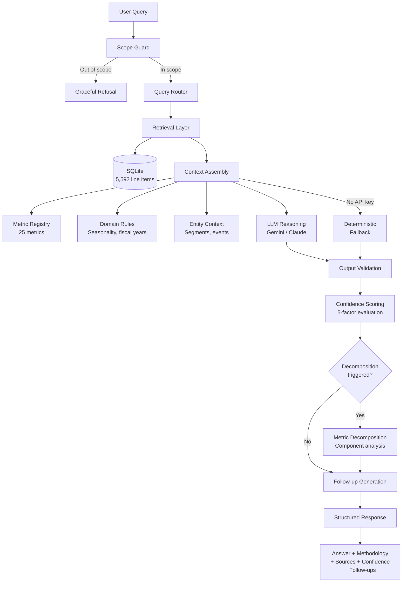

# LedgerAI

> A production-ready AI agent that answers questions about public company financials using SEC EDGAR filings — with full provenance, confidence scoring, and graceful failure handling.

Most AI agents work in demos but fail in production. The gap isn't in the LLM — it's in the context, guardrails, and failure handling. LedgerAI is a reference implementation of what the missing reliability layer looks like.

## What It Does

- **Answers questions about public company financials** — revenue trends, margin analysis, EPS, cash flow, debt ratios — using data from SEC EDGAR filings (10-Q and 10-K)
- **Shows its work** — every answer includes calculation methodology, source filings, and a structured confidence score
- **Knows its limits** — refuses out-of-scope questions (investment advice, predictions) gracefully, explaining what it *can* help with
- **Investigates changes** — when a metric changes, decomposes *why* by breaking it into components and identifying the primary driver
- **Works without an LLM** — deterministic fallback mode provides structured data-driven answers with full provenance when no API key is configured

## Architecture



## What Makes It Different

The reliability layer is the product, not an afterthought:

| Layer | What It Does | Why It Matters |
|-------|-------------|----------------|
| **Metric Registry** | 25 financial metrics with formulas, caveats, comparability rules | The agent doesn't improvise what "gross margin" means — it looks it up |
| **Confidence Scoring** | 5-factor structured evaluation (data availability, complexity, temporal relevance, comparability, ambiguity) | Not a vibe check — calibrated scores with clear reasoning |
| **Provenance Tracking** | Every claim tagged with source filing, period, and calculation chain | Full audit trail from answer back to SEC filing |
| **Scope Guard** | Regex-based query classification with graceful refusals | Refuses investment advice, predictions, and non-financial questions with helpful redirects |
| **Investigation Workflows** | Predefined decomposition paths for 10+ metrics | When operating margin changes, breaks it into revenue vs. R&D vs. SGA contributions |
| **Failure Catalog** | 10 documented failure modes with mitigations | Honest about where the system breaks and how it handles it |

## Architecture Decisions

Two deliberate, contrarian choices:

1. **Single agent, not multi-agent** — the complexity is in context, not coordination. [Read the ADR](docs/adrs/001-single-agent.md)
2. **No agent framework** — no LangGraph, no ADK, no CrewAI. The orchestration is ~150 lines of Python. Every decision is visible in the code. [Read the ADR](docs/adrs/002-no-framework.md)

## Quick Start

```bash
# Clone and set up
git clone https://github.com/gaurav5421/ledgerai.git
cd ledgerai
python3 -m venv .venv
source .venv/bin/activate
pip install -r requirements.txt

# Configure API keys (optional — works without them)
cp .env.example .env
# Edit .env with your Gemini or Anthropic API key

# Download and process SEC filings
python scripts/download_filings.py
python scripts/seed_data.py

# Launch the UI
chainlit run ui/app.py
```

Or use the CLI demo:

```bash
python scripts/demo.py
```

## Evaluation Results

53 test cases across 5 categories. Honest about what works and what doesn't.

| Category | Result | What It Tests |
|----------|--------|---------------|
| Factual Accuracy | **15/15** (100%) | Do the numbers match the filings? |
| Guardrail Compliance | **12/12** (100%) | Does it refuse when it should? |
| Confidence Calibration | **8/8** (100%) | Are confidence scores meaningful? |
| Investigation Workflows | **8/8** (100%) | Do decompositions and follow-ups work? |
| Response Quality | **9/10** (90%) | Methodology, sources, follow-ups present? |
| **Total** | **52/53** (98%) | |

Run the eval suite yourself:

```bash
python eval/eval_suite.py
```

Run the test suite (168 tests):

```bash
pytest tests/ -v
```

## Covered Companies

| Ticker | Company | Industry | Filings |
|--------|---------|----------|---------|
| AAPL | Apple Inc. | Tech (Hardware) | 10-Q, 10-K |
| MSFT | Microsoft Corporation | Tech (Software) | 10-Q, 10-K |
| GOOGL | Alphabet Inc. | Tech (Software) | 10-Q, 10-K |
| AMZN | Amazon.com, Inc. | Tech (Mixed) | 10-Q, 10-K |
| JPM | JPMorgan Chase & Co. | Banking | 10-Q, 10-K |

113 filings, 5,592 financial line items across all companies.

## Project Structure

```
src/
├── agent/          # Core orchestration, retrieval, response formatting
├── context/        # Metric registry (25 metrics), domain rules, entity context
├── guardrails/     # Scope guard, confidence scoring, provenance tracking
├── investigation/  # Metric decomposition, contextual follow-ups, session state
└── ingestion/      # SEC EDGAR client, filing parser, data storage

tests/              # 168 pytest tests (unit + integration)
eval/               # 53-case evaluation suite with results
ui/                 # Chainlit chat interface
docs/               # Architecture, ADRs, guardrails, failure catalog
scripts/            # Data download, seeding, CLI demo
```

## Documentation

- [Architecture](docs/architecture.md) — system design and component overview
- [ADR: Single Agent](docs/adrs/001-single-agent.md) — why not multi-agent
- [ADR: No Framework](docs/adrs/002-no-framework.md) — why no LangGraph/ADK/CrewAI
- [Guardrails Design](docs/guardrails.md) — scope guard, confidence, provenance
- [Metrics Dictionary](docs/metrics-dictionary.md) — all 25 financial metrics
- [Failure Catalog](docs/failure-catalog.md) — 10 documented failure modes and mitigations

## Technology Stack

| Component | Technology | Why |
|-----------|-----------|-----|
| LLM | Gemini / Anthropic Claude | Supports both; works without either |
| Structured Data | SQLite | Zero infrastructure, portable |
| API | FastAPI | Async, auto-docs, Pydantic |
| UI | Chainlit | Polished chat UI, actions, starters |
| Parsing | BeautifulSoup + lxml | SEC filings are HTML/XML |
| Tests | pytest | 168 tests + 53-case eval suite |

## License

MIT — see [LICENSE](LICENSE).

SEC EDGAR data is public domain. This project is not affiliated with the SEC.

---

If you find this useful, consider giving it a star. It helps others discover the project.
