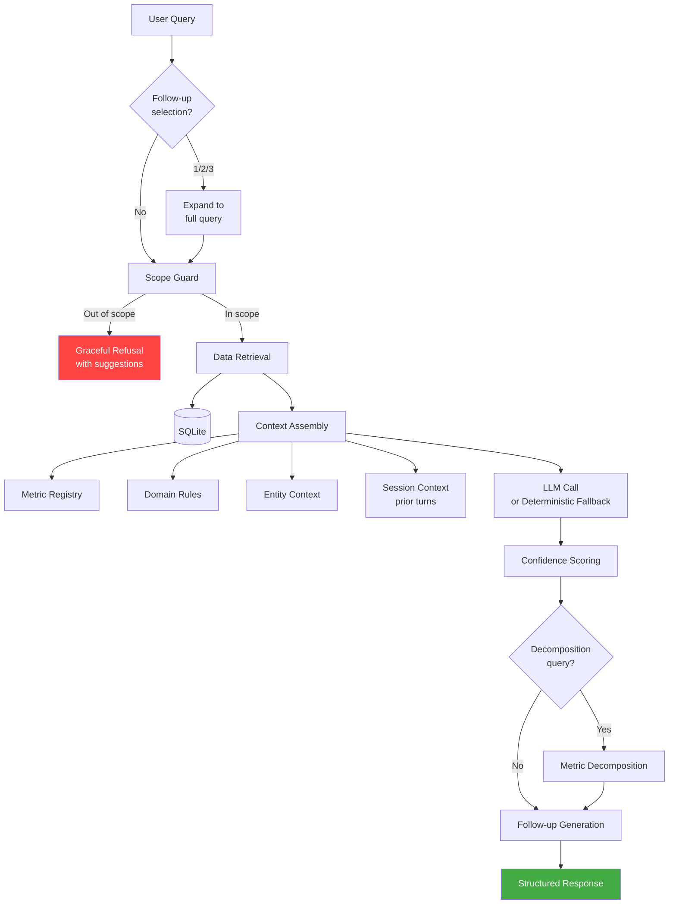

# Architecture

## Overview

LedgerAI is a single-agent system with modular internal components. The agent answers questions about public company financials using SEC EDGAR filings, with full provenance, confidence scoring, and guardrails.

**Key design principle:** Most of the intelligence is in the code *around* the LLM, not in the LLM itself. The LLM gets called once with a well-constructed prompt containing all the context it needs. Everything else — scope checking, data retrieval, metric definitions, confidence scoring, decomposition — is deterministic Python.

## System Flow



### ASCII Flow (for non-Mermaid renderers)

```
User Query
    │
    ▼
┌──────────────┐
│  Scope Guard │ ── Out of scope? → Graceful refusal with alternatives
└──────┬───────┘
       │ In scope
       ▼
┌──────────────────────────────────────┐
│         Retrieval Layer              │
│  ┌─────────┐     ┌────────────────┐ │
│  │   SQL   │     │ Vector Search  │ │
│  │ (SQLite)│     │  (ChromaDB)    │ │
│  └────┬────┘     └───────┬────────┘ │
└───────┼──────────────────┼──────────┘
        │                  │
        ▼                  ▼
┌──────────────────────────────────────┐
│       Context Assembly               │
│  + Metric definitions & formulas     │
│  + Domain rules (fiscal years, etc.) │
│  + Entity context (segments, events) │
│  + Comparability rules               │
│  + Investigation session context     │
└──────────────┬───────────────────────┘
               │
               ▼
┌──────────────────────────────────────┐
│         LLM Reasoning                │
│  Single call with full context       │
│  (Gemini / Anthropic Claude)         │
│  OR deterministic fallback           │
└──────────────┬───────────────────────┘
               │
               ▼
┌──────────────────────────────────────┐
│       Confidence Scoring             │
│  + Data availability       (35%)     │
│  + Calculation complexity  (20%)     │
│  + Temporal relevance      (15%)     │
│  + Comparability validity  (15%)     │
│  + Query ambiguity         (15%)     │
└──────────────┬───────────────────────┘
               │
               ▼
┌──────────────────────────────────────┐
│       Investigation Layer            │
│  + Metric decomposition (if "why")   │
│  + Contextual follow-up generation   │
│  + Session state recording           │
└──────────────┬───────────────────────┘
               │
               ▼
┌──────────────────────────────────────┐
│       Structured Response            │
│  + Answer                            │
│  + Methodology (show the math)       │
│  + Sources (filing references)       │
│  + Confidence level & score          │
│  + Decomposition (if triggered)      │
│  + Follow-up suggestions             │
└──────────────────────────────────────┘
```

## Key Components

### Data Layer
- **SQLite** — structured financial data (5,592 line items) extracted from SEC filings
- **ChromaDB** — vector store for filing text (MD&A, risk factors, footnotes) for qualitative questions

### Context Layer
- **Metric Registry** (`src/context/metric_registry.py`) — 25 financial metrics with formulas, components, caveats, typical ranges, and comparability rules
- **Domain Rules** (`src/context/domain_rules.py`) — fiscal year mappings, seasonality notes, cross-industry comparison warnings
- **Entity Context** (`src/context/entity_context.py`) — per-company knowledge: business segments, reporting quirks, major events, comparable companies

### Guardrails
- **Scope Guard** (`src/guardrails/scope_guard.py`) — classifies queries as in-scope, partial, or out-of-scope using regex patterns
- **Confidence Scoring** (`src/guardrails/confidence.py`) — 5-factor weighted evaluation producing calibrated scores
- **Provenance Tracking** (`src/guardrails/provenance.py`) — tags every claim with source filing and calculation chain

### Investigation Layer
- **Metric Decomposition** (`src/investigation/decomposition.py`) — predefined decomposition paths for 10+ metrics; identifies primary driver of changes
- **Contextual Follow-ups** (`src/investigation/follow_ups.py`) — data-driven suggestions based on actual retrieved values, not templates
- **Session State** (`src/investigation/session.py`) — multi-turn conversation tracking with depth classification (summary → detail → comparison → decomposition)

### Agent Core
- **Orchestration** (`src/agent/core.py`) — ~150 lines of pipeline logic connecting all components
- **Retrieval** (`src/agent/retrieval.py`) — SQL queries for financial data, derived metric calculations
- **Response** (`src/agent/response.py`) — structured output formatting

## Technology Stack

| Component | Technology | Why |
|-----------|-----------|-----|
| LLM | Gemini / Anthropic Claude | Supports both; deterministic fallback without either |
| Structured Data | SQLite | Zero infrastructure, portable, sufficient for demo scale |
| Vector Store | ChromaDB (local) | Embedded mode, no server needed |
| API | FastAPI | Async, auto-docs, Pydantic integration |
| UI | Chainlit | Polished chat UI with actions, starters, sidebar elements |
| Parsing | BeautifulSoup + lxml | SEC filings are HTML/XML |
| Tests | pytest | 168 unit + integration tests |
| Eval | Custom suite | 53 cases across 5 categories |

## Design Constraints

1. **No framework** — orchestration is explicit Python, not abstracted behind a framework
2. **Single agent** — one LLM call per query (occasionally two for complex decomposition)
3. **Deterministic when possible** — metric calculations, decomposition, follow-ups are all Python, not LLM-generated
4. **Portable** — no cloud services required; everything runs locally with SQLite and ChromaDB
5. **Honest** — confidence scoring, refusals, and the failure catalog exist to show where the system works and where it doesn't
